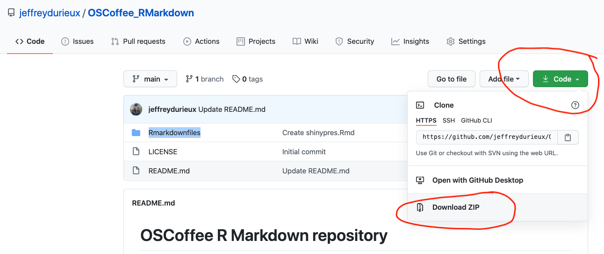

# OSCoffee R Markdown repository 

Repository for R Markdown OSCoffee meeting. Here are some very basic R markdown files that can be 'knitted' to different formats.

You can download this repository by simply click this button:

Demo R markdown files in this repo:

## Documents
- [html example](https://github.com/jeffreydurieux/OSCoffee_RMarkdown/blob/main/Rmarkdownfiles/html.Rmd)
- [pdf example](https://github.com/jeffreydurieux/OSCoffee_RMarkdown/blob/main/Rmarkdownfiles/pdf.Rmd)
- [word example](https://github.com/jeffreydurieux/OSCoffee_RMarkdown/blob/main/Rmarkdownfiles/word.Rmd)

## Presentations
- [powerpoint](https://github.com/jeffreydurieux/OSCoffee_RMarkdown/blob/main/Rmarkdownfiles/ppt.Rmd)
- [R shiny presentation](https://github.com/jeffreydurieux/OSCoffee_RMarkdown/blob/main/Rmarkdownfiles/shinypres.Rmd)

## Dashboard
- [Dashboard example](https://github.com/jeffreydurieux/OSCoffee_RMarkdown/blob/main/Rmarkdownfiles/dashboard.Rmd)

